---
title: Discussion 11 ??? Implementation Roadmap
---

---
title: Discussion 11 ??? Implementation Roadmap
---
## Status
???? **Finalized**
## Topic
The phased implementation plan to reach the full fill architecture defined in Discussion 10, starting from the verified current state. Includes explicit Cold-Start Pipeline for first-time portal encounters.
## Goal
Define the exact order of work ??? what to build, what it unblocks, what each phase resolves ??? so every sprint has a clear target. Every architecture exception has a planned removal. The Cold-Start Pipeline (unknown portal, zero knowledge) is an explicit first-class concern.
---
## Verified Current State
**Branch:** `phase-3-perception`
**Commit:** `5f57249` ??? Phase 3.2: Widget Classification & Adapter Contracts (#100)
**Tests:** 654 passing across 13 suites
### Implemented Modules
<table header-row="true">
<tr>
<td>Layer</td>
<td>Module</td>
<td>Status</td>
</tr>
<tr>
<td>Perception</td>
<td>`index.js` (perceivePage API)</td>
<td>??? Implemented (Phase 3.1)</td>
</tr>
<tr>
<td>Perception</td>
<td>`snapshot-builder.js`</td>
<td>??? Implemented</td>
</tr>
<tr>
<td>Perception</td>
<td>`privacy-filter.js`</td>
<td>??? Implemented</td>
</tr>
<tr>
<td>Perception</td>
<td>`binding-registry.js`</td>
<td>??? Implemented</td>
</tr>
<tr>
<td>Perception</td>
<td>`context-discovery.js`</td>
<td>??? Implemented</td>
</tr>
<tr>
<td>Perception</td>
<td>`node-factory.js`</td>
<td>??? Implemented</td>
</tr>
<tr>
<td>Perception</td>
<td>`edge-factory.js`</td>
<td>??? Implemented</td>
</tr>
<tr>
<td>Perception</td>
<td>`revision-manager.js`</td>
<td>??? Implemented</td>
</tr>
<tr>
<td>Perception</td>
<td>`validator.js`</td>
<td>??? Implemented</td>
</tr>
<tr>
<td>Perception</td>
<td>`canonical-hash.js`</td>
<td>??? Implemented</td>
</tr>
<tr>
<td>Perception</td>
<td>`widget-classifier.js`</td>
<td>??? Implemented (Phase 3.2)</td>
</tr>
<tr>
<td>Perception</td>
<td>`delta-emitter.js`</td>
<td>??? Not yet implemented</td>
</tr>
<tr>
<td>Runtime</td>
<td>`dom-gateway.js`</td>
<td>??? Implemented</td>
</tr>
<tr>
<td>Runtime</td>
<td>`plugin-bridge.js`</td>
<td>??? Implemented</td>
</tr>
<tr>
<td>Runtime</td>
<td>`resolver.js`</td>
<td>??? Implemented</td>
</tr>
<tr>
<td>Runtime</td>
<td>`runner.js`</td>
<td>??? Implemented</td>
</tr>
<tr>
<td>Knowledge</td>
<td>`knowledge-store.js`</td>
<td>??? Frozen (Phase 2)</td>
</tr>
<tr>
<td>Knowledge</td>
<td>`knowledge-sync.js`</td>
<td>??? Frozen (Phase 2.8)</td>
</tr>
</table>
### Architecture Exceptions (Active)
<table header-row="true">
<tr>
<td>ID</td>
<td>Description</td>
<td>Resolution Phase</td>
</tr>
<tr>
<td>EXC-001</td>
<td>AI/LLM calls in page context</td>
<td>Phase 4.3</td>
</tr>
<tr>
<td>EXC-002</td>
<td>Strategic mapping in extension</td>
<td>Phase 4.1</td>
</tr>
<tr>
<td>EXC-003</td>
<td>Fill planning in popup.js</td>
<td>Phase 4.1</td>
</tr>
<tr>
<td>EXC-004</td>
<td>Teach/auto-teach in background.js</td>
<td>Phase 5.1</td>
</tr>
<tr>
<td>EXC-005</td>
<td>Derived values in extension</td>
<td>Phase 4.2</td>
</tr>
</table>
### What Phase 3.3 Actually Needs
Phase 3.1 already implemented the core perception engine. The remaining work for "Phase 3.3" is:
- `delta-emitter.js` ??? emit PageDelta on DOM mutations
- Integration testing with real portal pages
- Performance validation against the 200ms budget
---
## The Two Unknowns ??? Separated Pipelines
The system encounters two fundamentally different kinds of unknowns. They are independent problems that converge only at the Planner.
### Unknown #1: Semantic Field Mapping
**Question:** What does this page field mean? Which profileKey corresponds to it?
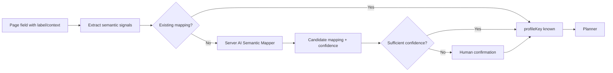
**Pipeline:** Perception ??? Server ??? Knowledge Lookup ??? (AI Mapping if none) ??? Planner
**Knowledge produced:** `field_mapping` records
### Unknown #2: Behavioral Interaction
**Question:** How does this page field behave? What sequence of actions operates it?
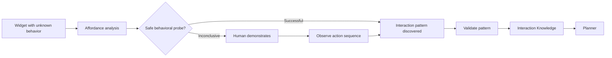
**Pipeline:** Perception ??? Server ??? Knowledge Lookup ??? (Behavioral Discovery if none) ??? Planner
**Knowledge produced:** Interaction Knowledge records (currently stored as `component_adapter` kind ??? existing records remain operational; new records follow D06 vocabulary)
### Independence
These problems are independent:
- A field can have **known semantics + unknown behavior** (Case K)
- A field can have **unknown semantics + known behavior** (Case L)
- A field can have **both unknown** (full cold-start)
- A field can have **both known** (steady-state)
The Planner requires BOTH to be sufficiently resolved before producing a concrete instruction.
---
## Cold-Start Pipeline ??? First Portal Encounter
When CyberControl encounters a completely new portal with zero existing knowledge, the following complete path executes:
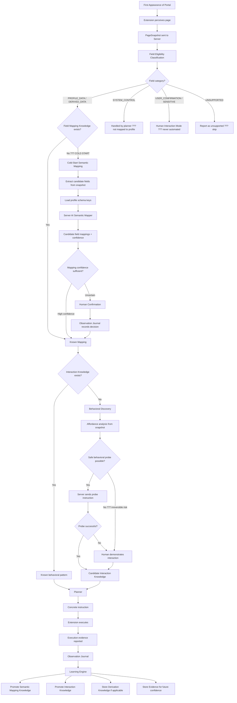
### Field Eligibility Classification
Before any semantic mapping attempt, the server classifies each interactive element:
<table header-row="true">
<tr>
<td>Category</td>
<td>Meaning</td>
<td>AI Mapping Allowed?</td>
<td>Examples</td>
</tr>
<tr>
<td>`PROFILE_DATA`</td>
<td>Directly maps to a customer profile field</td>
<td>??? Yes</td>
<td>Name, DOB, address, PIN code</td>
</tr>
<tr>
<td>`DERIVED_DATA`</td>
<td>Computed from profile fields via transformation</td>
<td>??? Yes (maps to sources + derivation)</td>
<td>Full Name, Age, formatted date</td>
</tr>
<tr>
<td>`SYSTEM_CONTROL`</td>
<td>Form navigation, workflow control</td>
<td>??? No ??? planner handles directly</td>
<td>Next, Save Draft, tab buttons</td>
</tr>
<tr>
<td>`USER_CONFIRMATION`</td>
<td>Requires human judgment or acknowledgment</td>
<td>??? No ??? Human Mode</td>
<td>Declaration checkbox, terms acceptance</td>
</tr>
<tr>
<td>`SENSITIVE`</td>
<td>Authentication, payment, irreversible action</td>
<td>??? No ??? Human Mode, never automated</td>
<td>OTP, CAPTCHA, payment, final submit</td>
</tr>
<tr>
<td>`UNKNOWN`</td>
<td>Cannot determine category from available evidence</td>
<td>??? No ??? escalate to human</td>
<td>Ambiguous unlabeled elements</td>
</tr>
<tr>
<td>`UNSUPPORTED`</td>
<td>Inaccessible or outside system capability</td>
<td>??? No ??? skip and report</td>
<td>Cross-origin iframes, opaque contexts</td>
</tr>
</table>
**Key rule:** "Unknown field" does NOT mean "AI is allowed to fill it." Only fields classified as `PROFILE_DATA` or `DERIVED_DATA` enter the semantic mapping pipeline. All other categories are handled by their appropriate safety/authorization path.
### Who performs the first mapping?
**The server-side AI Semantic Mapping pipeline.**
The extension MUST NOT perform this mapping. It observes the page, produces a PageSnapshot, and sends it to the server. The server ??? using the AI key configured through owner-panel ??? performs semantic analysis and proposes candidate mappings.
### Multi-Source Semantic Mappings
When a portal field requires data from multiple profile sources, the semantic mapping must express this explicitly:
```javascript
Mapping for "Full Name":
  target: "full_name_field"
  sources:
    - profile.first_name
    - profile.middle_name
    - profile.last_name
  transformation: concatenate_name
```
And conversely, when one profile value populates multiple portal fields:
```javascript
Mapping for profile.date_of_birth:
  targets:
    - { field: "dob_day", transformation: extract_day }
    - { field: "dob_month", transformation: extract_month }
    - { field: "dob_year", transformation: extract_year }
```
The separation is:
1. **Semantic Mapping** ??? identifies which profile fields are the source(s) for a portal field
2. **Transformation / Derivation** ??? defines how source values become the final value
3. **Fill Plan** ??? includes the pre-computed final value
The AI Semantic Mapper proposes the source mapping. The Derivation Engine (Phase 4.2) computes the transformation. The Planner assembles the final instruction with concrete values.
### What gets learned after first encounter?
A successful first encounter produces up to four independent knowledge artifacts:
<table header-row="true">
<tr>
<td>Knowledge Type</td>
<td>What It Contains</td>
<td>Promotion Path</td>
</tr>
<tr>
<td>**Semantic Mapping**</td>
<td>profileKey(s) ??? page-field association + transformation type</td>
<td>AI candidate ??? validated (evidence-based) ??? confirmed (human approval)</td>
</tr>
<tr>
<td>**Interaction Knowledge**</td>
<td>Behavioral pattern for operating the widget</td>
<td>Candidate ??? validated (after successful execution + verification)</td>
</tr>
<tr>
<td>**Derivation Knowledge**</td>
<td>How profile values must be transformed for this field</td>
<td>Learned from correction or explicit rule</td>
</tr>
<tr>
<td>**Evidence**</td>
<td>What actually happened during the encounter</td>
<td>Remains in Observation Journal; feeds Learning Engine</td>
</tr>
</table>
The Learning Engine promotes each independently. A semantic mapping can be confirmed while the interaction pattern is still a candidate.
---
## Cold-Start Cases ??? Architecture Validation
<table header-row="true">
<tr>
<td>Case</td>
<td>Scenario</td>
<td>Pipeline Path</td>
</tr>
<tr>
<td>**A**</td>
<td>"District" clearly maps to `profile.district`</td>
<td>Eligibility: PROFILE_DATA ??? AI Semantic Mapper proposes with high confidence ??? Planner uses directly</td>
</tr>
<tr>
<td>**B**</td>
<td>"Permanent Address" could mean multiple profile fields</td>
<td>Eligibility: PROFILE_DATA ??? AI proposes with low confidence ??? Human Confirmation ??? operator selects correct mapping</td>
</tr>
<tr>
<td>**C**</td>
<td>"Full Name" must be constructed from first/middle/last</td>
<td>Eligibility: DERIVED_DATA ??? AI maps to sources `[profile.first_name, profile.middle_name, profile.last_name]` with transformation `concatenate_name` ??? Derivation Engine computes final value</td>
</tr>
<tr>
<td>**D**</td>
<td>One profile field must populate three portal fields (DOB ??? day/month/year)</td>
<td>Eligibility: DERIVED_DATA for each ??? AI maps all three to source `profile.dob` with transformations `extract_day`, `extract_month`, `extract_year` ??? Derivation Engine splits</td>
</tr>
<tr>
<td>**E**</td>
<td>A field has no visible label</td>
<td>Eligibility: UNKNOWN (no evidence to classify) ??? escalate to Human Confirmation ??? operator identifies field ??? mapping stored</td>
</tr>
<tr>
<td>**F**</td>
<td>Same label, different meanings in different sections</td>
<td>Eligibility: PROFILE_DATA ??? AI receives section headings as context ??? produces section-qualified mappings (e.g., "Address" in "Permanent Address" section ??? "Address" in "Correspondence" section)</td>
</tr>
<tr>
<td>**G**</td>
<td>Field appears only after another field is filled (cascade)</td>
<td>First fill triggers DOM change ??? Extension emits PageDelta ??? Server re-evaluates ??? discovers new field ??? classifies eligibility ??? maps ??? plans next instruction</td>
</tr>
<tr>
<td>**H**</td>
<td>AI proposes a wrong mapping</td>
<td>Operator corrects during fill ??? Correction stored as evidence ??? Learning Engine degrades AI mapping confidence ??? promotes corrected mapping</td>
</tr>
<tr>
<td>**I**</td>
<td>AI has no API key available</td>
<td>Server detects no key ??? Human Interaction Mode for ALL eligible unmapped fields ??? operator fills manually ??? server observes ??? extracts semantic mappings from observation evidence</td>
</tr>
<tr>
<td>**J**</td>
<td>Portal has no existing Interaction Knowledge</td>
<td>Behavioral Discovery: affordance analysis ??? safe probe or Human Teach ??? store Interaction Knowledge</td>
</tr>
<tr>
<td>**K**</td>
<td>Known semantic mapping, unknown widget behavior</td>
<td>Semantic mapping resolves immediately ??? Behavioral Discovery for interaction ??? Planner waits for both ??? instruction</td>
</tr>
<tr>
<td>**L**</td>
<td>Known behavior, ambiguous semantic mapping</td>
<td>Interaction Knowledge resolves immediately ??? AI Semantic Mapper or Human Confirmation for semantics ??? Planner waits for both ??? instruction</td>
</tr>
</table>
Every case has an explicit path. No undefined gaps.
---
## Revised Dependency Graph
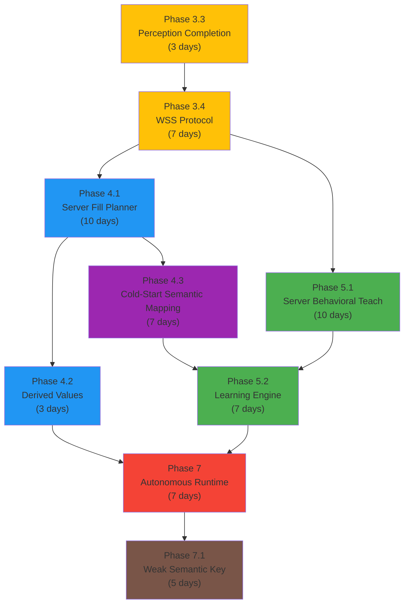
### Critical Path Analysis
Phase 7 depends on Phase 5.2, which depends on BOTH:
- Path A: 3.3(3d) ??? 3.4(7d) ??? 4.1(10d) ??? 4.3(7d) ??? 5.2(7d) ??? 7(7d) = **41 days**
- Path B: 3.3(3d) ??? 3.4(7d) ??? 5.1(10d) ??? 5.2(7d) ??? 7(7d) = **34 days**
**Critical path: 3.3 ??? 3.4 ??? 4.1 ??? 4.3 ??? 5.2 ??? 7** (41 days sequential)
Path B (behavioral teach) is shorter and runs parallel to 4.1 + 4.3. It is NOT on the critical path unless it overruns.
Phase 4.2 (Derived Values, 3 days) is also off the critical path ??? it depends only on 4.1 and feeds into 7.
**With parallelism:** 5.1 runs alongside 4.1 + 4.3. Total wall-clock: \~6 weeks.
---
## Phase 3.3: Perception Completion
**Status:** Mostly implemented (Phase 3.1 built the core)
**Remaining:** `delta-emitter.js` + integration tests + performance validation
**Duration:** 2???3 days
### Done Criteria
- PageDelta emitted on relevant DOM mutations
- Integration tests with real portal fixtures produce valid PageSnapshot v2
- Performance budget confirmed: \< 200ms for snapshot generation
---
## Phase 3.4: WSS Protocol
**Duration:** 5???7 days
**Depends on:** Phase 3.3
### What to Build
<table header-row="true">
<tr>
<td>Module</td>
<td>Location</td>
<td>Purpose</td>
</tr>
<tr>
<td>`ws-server.js`</td>
<td>`extension-service/`</td>
<td>WebSocket server (upgrade from Express)</td>
</tr>
<tr>
<td>`ws-handlers.js`</td>
<td>`extension-service/`</td>
<td>Message routing: snapshot, instruction, observation</td>
</tr>
<tr>
<td>`ws-client.js`</td>
<td>`extension/runtime/`</td>
<td>Extension WSS client (from service worker)</td>
</tr>
<tr>
<td>`reconnect-manager.js`</td>
<td>`extension/runtime/`</td>
<td>Reconnection with exponential backoff</td>
</tr>
</table>
### Transport Design (per Discussion 08)
- **WSS:** Live runtime channel ??? fill instructions, observations, teach sessions, deltas
- **HTTPS:** Ordinary API ??? knowledge sync, profile CRUD, configuration, bootstrap
**No blanket HTTPS fallback.** The complete WSS runtime is NOT duplicated over HTTPS. Instead:
<table header-row="true">
<tr>
<td>If WSS drops during...</td>
<td>Behavior</td>
</tr>
<tr>
<td>Fill session</td>
<td>Extension preserves instruction state. Reconnects. Server resumes from last confirmed observation.</td>
</tr>
<tr>
<td>Teach session</td>
<td>Session pauses. Reconnects. Server resumes teach state machine.</td>
</tr>
<tr>
<td>Idle</td>
<td>No impact. Reconnect on next activity.</td>
</tr>
<tr>
<td>Extended outage</td>
<td>Extension enters Suspended Mode. No autonomous action.</td>
</tr>
</table>
### Done Criteria
- WSS connection establishes with auth token
- PageSnapshot transmitted over WSS
- Instructions received and forwarded to runner
- Reconnection with exponential backoff (configurable policy)
- Heartbeat with configurable interval
- Message envelope validated on both sides
---
## Phase 4.1: Server Fill Planner (Known Forms)
**Resolves:** EXC-002, EXC-003
**Duration:** 7???10 days
**Depends on:** Phase 3.4
### What to Build
<table header-row="true">
<tr>
<td>Module</td>
<td>Location</td>
<td>Purpose</td>
</tr>
<tr>
<td>`fill-planner.js`</td>
<td>`extension-service/`</td>
<td>Orchestrates: eligibility ??? knowledge lookup ??? mapping resolution ??? plan building</td>
</tr>
<tr>
<td>`field-classifier.js`</td>
<td>`extension-service/`</td>
<td>Classifies fields by eligibility category</td>
</tr>
<tr>
<td>`mapping-engine.js`</td>
<td>`extension-service/`</td>
<td>Resolves field???profileKey from knowledge store</td>
</tr>
<tr>
<td>`plan-builder.js`</td>
<td>`extension-service/`</td>
<td>Constructs ordered ActionPlan v3</td>
</tr>
<tr>
<td>`dependency-resolver.js`</td>
<td>`extension-service/`</td>
<td>Cascade field ordering</td>
</tr>
<tr>
<td>`fill-session.js`</td>
<td>`extension-service/`</td>
<td>Tracks fill progress, stores evidence</td>
</tr>
</table>
### The Critical Fork: field_mappings = NONE
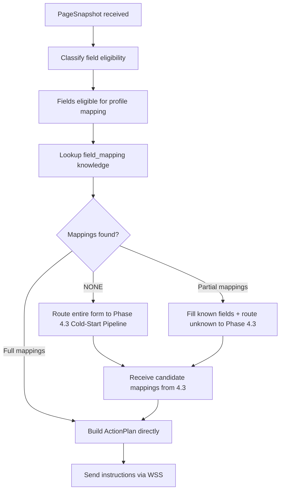
When `field_mappings = NONE`, the Fill Planner explicitly delegates to the Cold-Start Semantic Mapping pipeline (Phase 4.3). There is no undefined gap.
### Multi-Dimensional Shadow Promotion
Promotion from shadow mode to server-primary does NOT use a single aggregate percentage. Independent gates:
<table header-row="true">
<tr>
<td>Dimension</td>
<td>Measurement</td>
<td>Promotion Blocked If</td>
</tr>
<tr>
<td>Field mapping correctness</td>
<td>Fields mapped identically by server vs extension</td>
<td>Any difference in eligible fields</td>
</tr>
<tr>
<td>Critical-field correctness</td>
<td>Name, DOB, address, ID number fields</td>
<td>ANY critical field mapped differently</td>
</tr>
<tr>
<td>Verification success</td>
<td>Extension confirms value matches after fill</td>
<td>Any verification failure on server plan</td>
</tr>
<tr>
<td>Operator corrections</td>
<td>Corrections triggered by server-planned fill</td>
<td>More corrections than extension path</td>
</tr>
<tr>
<td>Execution failures</td>
<td>Instructions that fail to execute</td>
<td>Any new failure not present in extension path</td>
</tr>
</table>
**A single critical-field error blocks promotion regardless of overall agreement.** This prevents scenarios where 99% correctness masks a dangerous Father Name ??? Mother Name swap.
### Done Criteria
- Server generates ActionPlan from knowledge + profile + snapshot
- Field eligibility classification prevents non-profile fields from entering mapping
- When mappings = NONE, delegates to Cold-Start (Phase 4.3)
- Shadow mode validates using multi-dimensional criteria (no single-percentage threshold)
- Extension popup.js no longer calls mapper.js / rule-engine.js
- Fill sessions recorded with server plan ID
- Corrections captured and routed to /api/corrections
- Cascade fields filled in correct dependency order
- EXC-002 and EXC-003 resolved
---
## Phase 4.2: Server-Side Derived Values
**Resolves:** EXC-005
**Duration:** 2???3 days
**Depends on:** Phase 4.1
### What to Build
<table header-row="true">
<tr>
<td>Module</td>
<td>Location</td>
<td>Purpose</td>
</tr>
<tr>
<td>`derivation-engine.js`</td>
<td>`extension-service/`</td>
<td>Computes derived values from profile sources + transformation rules</td>
</tr>
</table>
### Derivation Model
The Derivation Engine operates on the output of semantic mapping:
```javascript
Input from Semantic Mapper:
  target: "full_name_field"
  sources: [profile.first_name, profile.middle_name, profile.last_name]
  transformation: concatenate_name

Derivation Engine computes:
  final_value: "Rahul Kumar Singh"

Fill Plan receives:
  { field: "full_name_field", value: "Rahul Kumar Singh" }
```
Derivation rules are stored as `derivation_rule` knowledge records and evolve from corrections.
### Done Criteria
- All derivation rules from `derive.js` ported to server
- Multi-source mappings resolved (multiple profile fields ??? one portal field)
- One-to-many mappings resolved (one profile field ??? multiple portal fields)
- Derivation rules stored as knowledge records
- Extension `derive.js` removed
- EXC-005 resolved
---
## Phase 4.3: Cold-Start Semantic Mapping
**Resolves:** EXC-001
**Duration:** 5???7 days
**Depends on:** Phase 4.1 (planner routes exist to delegate to)
### What to Build
<table header-row="true">
<tr>
<td>Module</td>
<td>Location</td>
<td>Purpose</td>
</tr>
<tr>
<td>`semantic-mapper.js`</td>
<td>`extension-service/`</td>
<td>Orchestrates AI semantic mapping for eligible unknown fields</td>
</tr>
<tr>
<td>`ai-key-manager.js`</td>
<td>`extension-service/`</td>
<td>Centralized AI key access from owner-panel config</td>
</tr>
<tr>
<td>`prompt-builder.js`</td>
<td>`extension-service/`</td>
<td>Builds mapping prompts from snapshot fields + profile schema</td>
</tr>
<tr>
<td>`confidence-evaluator.js`</td>
<td>`extension-service/`</td>
<td>Evaluates AI confidence, decides if human confirmation needed</td>
</tr>
</table>
### Complete Cold-Start Sequence
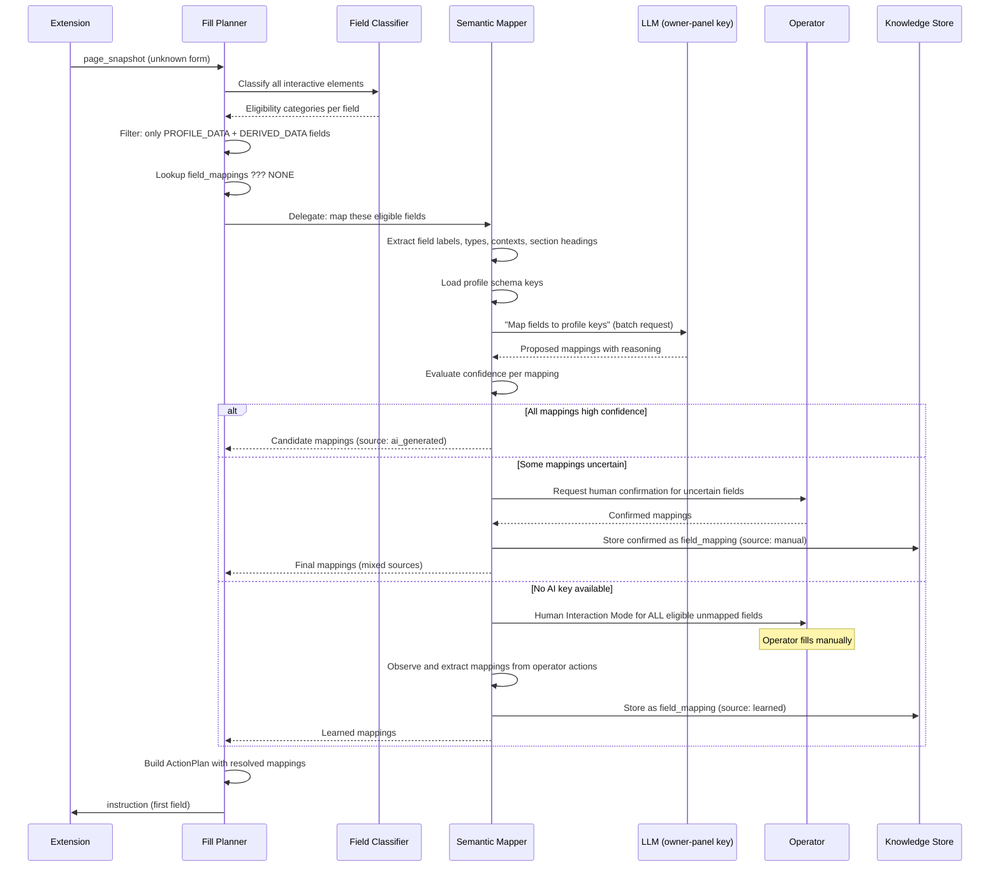
### AI-Generated Mapping Representation
The AI Semantic Mapper produces mappings that can express multi-source relationships:
```yaml
# Simple 1:1 mapping
- target: "district_field"
  sources: ["profile.district"]
  transformation: null
  confidence: 0.92

# Multi-source derived mapping
- target: "full_name_field"
  sources: ["profile.first_name", "profile.middle_name", "profile.last_name"]
  transformation: "concatenate_name"
  confidence: 0.88

# One-to-many (same source, multiple targets)
- target: "dob_day_field"
  sources: ["profile.dob"]
  transformation: "extract_day"
  confidence: 0.95
- target: "dob_month_field"
  sources: ["profile.dob"]
  transformation: "extract_month"
  confidence: 0.95
```
The AI must NOT invent profile keys that do not exist in the profile schema. If the profile has `first_name`, `middle_name`, `last_name` but no `full_name`, the mapping expresses the multi-source relationship rather than referencing a non-existent key.
### Evidence-Based Knowledge Promotion
AI-generated mappings do NOT become trusted merely because one execution succeeded. Promotion is evidence-based:
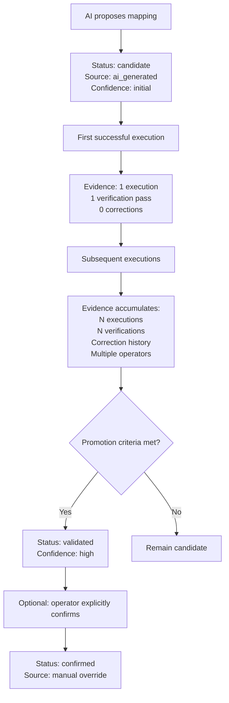
**Promotion criteria for semantic mappings:**
<table header-row="true">
<tr>
<td>Evidence Dimension</td>
<td>Required</td>
</tr>
<tr>
<td>Successful executions</td>
<td>??? N (configurable, e.g., 3)</td>
</tr>
<tr>
<td>Verification passes</td>
<td>100% (every execution verified)</td>
</tr>
<tr>
<td>Operator corrections on this mapping</td>
<td>0 in recent window</td>
</tr>
<tr>
<td>Semantic consistency</td>
<td>AI reasoning aligns with field context</td>
</tr>
<tr>
<td>Cross-operator agreement</td>
<td>If multiple operators, no disagreement</td>
</tr>
</table>
A mapping that happened to succeed once but was corrected the next time does NOT get promoted. The evidence must be consistently positive.
### Done Criteria
- Server maps unknown forms using AI (extension never calls AI)
- Field eligibility classification prevents non-profile fields from reaching AI
- API key stored server-side only
- AI results stored as candidate `field_mapping` knowledge with multi-source support
- Confidence evaluation decides human confirmation need
- No-AI-key path produces mappings from operator observation
- Evidence-based promotion (not single-execution success)
- Rate limiting active
- EXC-001 fully resolved
---
## Phase 5.1: Server Behavioral Teach (Unknown Widgets)
**Resolves:** EXC-004
**Duration:** 7???10 days
**Depends on:** Phase 3.4 (WSS for real-time coordination)
### What to Build
<table header-row="true">
<tr>
<td>Module</td>
<td>Location</td>
<td>Purpose</td>
</tr>
<tr>
<td>`teach-orchestrator.js`</td>
<td>`extension-service/`</td>
<td>Server-side teach session state machine</td>
</tr>
<tr>
<td>`ws-handlers/teach.js`</td>
<td>`extension-service/`</td>
<td>WSS handlers for teach messages</td>
</tr>
<tr>
<td>`teach-client.js`</td>
<td>`extension/runtime/`</td>
<td>Lightweight teach executor (observe + report)</td>
</tr>
<tr>
<td>`pattern-extractor.js`</td>
<td>`extension-service/`</td>
<td>Extracts Interaction Knowledge from observations</td>
</tr>
</table>
### Behavioral Discovery (per Discussion 03)
The system reasons about **affordances and behavior**, not frameworks:
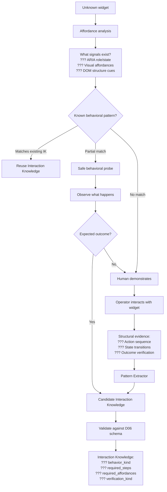
### What the System Does NOT Do
- Does NOT identify "React Select" or "MUI Autocomplete" or any framework by name
- Does NOT match against framework CSS signatures
- Does NOT use CSS class names as knowledge identity
- DOES observe: what affordances exist, what actions produce outcomes, what verifies success
- DOES reason about: behavioral fingerprints, state transitions, affordance patterns
### Interaction Knowledge Schema (per Discussion 06)
```javascript
identity: hash(behavior_kind + required_steps + required_affordances + verification_kind)

behavior_kind: "searchable_dropdown" | "date_picker" | "file_upload" | ...
required_steps: [{ action, target_affordance, expected_outcome }]
required_affordances: ["listbox", "combobox", "searchable_input", ...]
verification_kind: "value_changed" | "selection_visible" | "attribute_set" | ...
preconditions: [{ affordance_present, state_condition }]
variants: [{ context_condition, step_modifications }]
```
### Compatibility with Existing `component_adapter`
The current knowledge store uses kind `component_adapter`. Per Discussion 06, the correct vocabulary is **Interaction Knowledge**. Migration path:
- Existing `component_adapter` records remain operational (no breaking change)
- New records follow the D06 Interaction Knowledge model
- A future non-breaking migration renames/evolves the kind field
- This avoids unnecessary migration risk while ensuring new knowledge is architecturally correct
### Done Criteria
- Server orchestrates behavioral teach via WSS
- Operator demonstration ??? stored Interaction Knowledge
- Behavioral probing works for widgets with clear affordances (using affordance analysis, not framework identification)
- No framework names in knowledge records or probe logic
- `background.js` teach functions removed
- No AI/LLM calls from extension during teach
- Existing `component_adapter` records continue working (compatibility preserved)
- EXC-004 resolved
---
## Phase 5.2: Learning Engine (Corrections ??? Knowledge)
**Duration:** 5???7 days
**Depends on:** Phase 4.1, Phase 4.3, Phase 5.1
### What to Build
<table header-row="true">
<tr>
<td>Module</td>
<td>Location</td>
<td>Purpose</td>
</tr>
<tr>
<td>`learning-engine.js`</td>
<td>`extension-service/`</td>
<td>Processes evidence ??? knowledge updates</td>
</tr>
<tr>
<td>`confidence-manager.js`</td>
<td>`extension-service/`</td>
<td>Manages independent confidence lifecycles</td>
</tr>
<tr>
<td>`generalization-engine.js`</td>
<td>`extension-service/`</td>
<td>Cross-user knowledge promotion</td>
</tr>
</table>
### Independent Promotion Paths
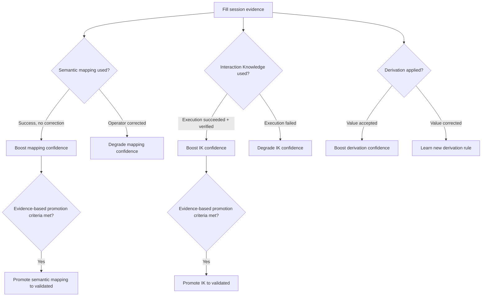
Each knowledge type has its own confidence lifecycle (per D06). Semantic mapping confidence and Interaction Knowledge confidence are independent. One can be promoted while the other remains a candidate.
### Done Criteria
- Corrections automatically update confidence (per knowledge type independently)
- Evidence-based promotion: not just "one success" but accumulated multi-dimensional evidence
- Consistent corrections across users promote to higher scope
- Degraded knowledge triggers re-resolution (Cold-Start or Behavioral Discovery)
- Observation Journal receives all session evidence
---
## Phase 7: Autonomous Runtime
**Duration:** 5???7 days
**Depends on:** ALL previous phases (4.1, 4.2, 4.3, 5.1, 5.2)
### Scope
Phase 7 is the integration phase:
<table header-row="true">
<tr>
<td>Concern</td>
<td>What happens</td>
</tr>
<tr>
<td>Legacy code removal</td>
<td>Remove `mapper.js`, `ai-resolve.js`, `derive.js`, `rule-engine.js`, `llm-client.js`</td>
</tr>
<tr>
<td>Architecture exception cleanup</td>
<td>Remove all EXC-001..005 from `constitution.yml`</td>
</tr>
<tr>
<td>End-to-end validation</td>
<td>Complete pipeline tested against real portals</td>
</tr>
<tr>
<td>`popup.js` simplification</td>
<td>Fill path becomes: perceive ??? send snapshot ??? receive instructions ??? execute ??? report</td>
</tr>
</table>
### Done Criteria
- All 5 architecture exceptions removed
- Legacy code removed from extension
- `constitution.yml` has no `temporary_exceptions`
- End-to-end fill time \< 3s for known forms
- Extension manifest.json reduced
---
## Phase 7.1: Weak Semantic Key (ServicePlus-like Portals)
**Duration:** 3???5 days
**Depends on:** Phase 7
This is a **form/workflow identity** problem. It requires the complete architecture because:
- Needs Cold-Start Pipeline (4.3) to map forms that can't be distinguished by labels
- Needs Learning Engine (5.2) to remember portal-specific identity strategies
- Needs `portal_definition` knowledge records
### Done Criteria
- ServicePlus-like portals get distinct form keys
- Multi-signal form identity: URL path + page title + hidden fields + field signature
- `portal_definition` knowledge records define per-portal identity strategies
---
## Suspended Mode (Server Unreachable)
**Architectural principle:** The extension is Eyes + Hands. It MUST NOT become an autonomous planner when the server is unavailable.
### What the Extension MAY Do
<table header-row="true">
<tr>
<td>Action</td>
<td>Reason</td>
</tr>
<tr>
<td>Preserve local transport state</td>
<td>Mechanical state preservation</td>
</tr>
<tr>
<td>Buffer observations temporarily</td>
<td>Evidence is not lost</td>
</tr>
<tr>
<td>Continue executing instructions already received and confirmed safe</td>
<td>Deterministic completion of authorized work</td>
</tr>
<tr>
<td>Attempt reconnection with backoff</td>
<td>Transport recovery</td>
</tr>
<tr>
<td>Display status to operator</td>
<td>UI responsibility</td>
</tr>
</table>
### What the Extension MUST NOT Do
<table header-row="true">
<tr>
<td>Action</td>
<td>Reason</td>
</tr>
<tr>
<td>Use cached knowledge to plan fills</td>
<td>This is planning ??? server responsibility</td>
</tr>
<tr>
<td>Choose which fields to fill</td>
<td>This is strategic mapping</td>
</tr>
<tr>
<td>Call AI/LLM for resolution</td>
<td>This is AI reasoning</td>
</tr>
<tr>
<td>Decide recovery strategy</td>
<td>This is judgment</td>
</tr>
<tr>
<td>Start a teach session</td>
<td>This is learning orchestration</td>
</tr>
<tr>
<td>Interpret corrections</td>
<td>This is knowledge interpretation</td>
</tr>
<tr>
<td>Select between alternative actions</td>
<td>This is autonomous decision-making</td>
</tr>
</table>
### Suspended State
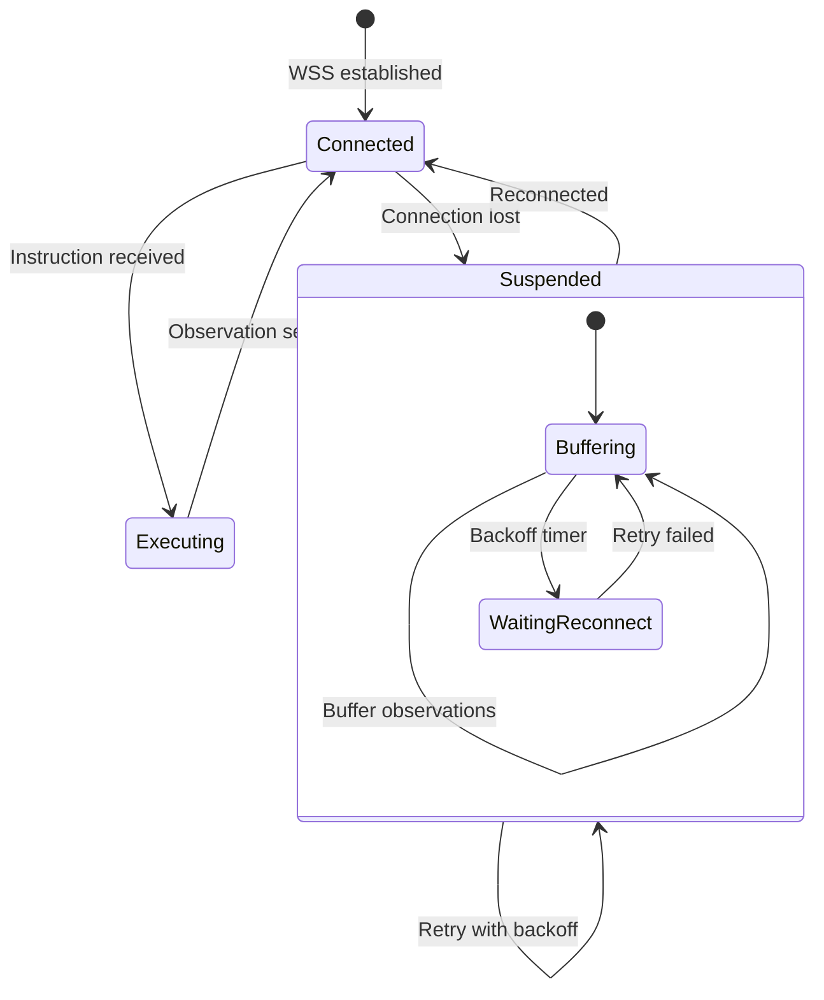
The extension does NOT silently degrade into a local fill engine. It suspends and informs the operator: "Server connection lost. Reconnecting..."
---
## Exception Resolution Timeline
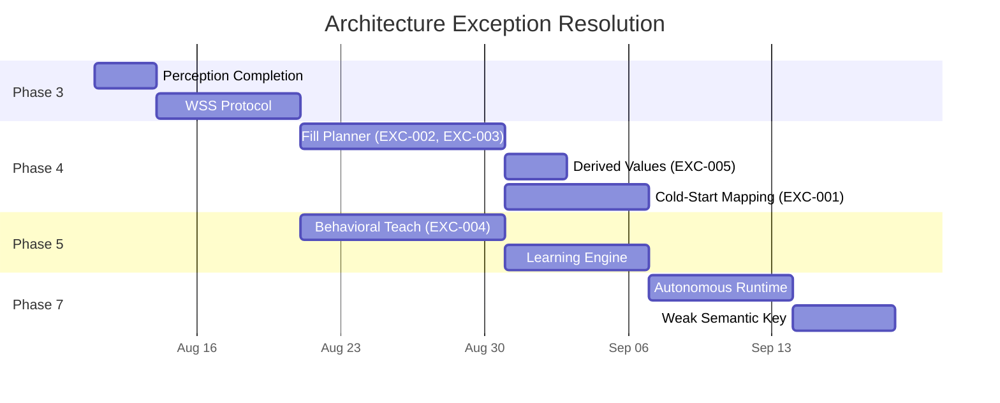
## Total Estimate
<table header-row="true">
<tr>
<td>Phase</td>
<td>Duration</td>
<td>Critical Path?</td>
</tr>
<tr>
<td>3.3 Perception Completion</td>
<td>2???3 days</td>
<td>???</td>
</tr>
<tr>
<td>3.4 WSS Protocol</td>
<td>5???7 days</td>
<td>???</td>
</tr>
<tr>
<td>4.1 Fill Planner</td>
<td>7???10 days</td>
<td>???</td>
</tr>
<tr>
<td>4.2 Derived Values</td>
<td>2???3 days</td>
<td>??? (parallel)</td>
</tr>
<tr>
<td>4.3 Cold-Start Semantic Mapping</td>
<td>5???7 days</td>
<td>???</td>
</tr>
<tr>
<td>5.1 Behavioral Teach</td>
<td>7???10 days</td>
<td>??? (parallel with 4.x)</td>
</tr>
<tr>
<td>5.2 Learning Engine</td>
<td>5???7 days</td>
<td>???</td>
</tr>
<tr>
<td>7 Autonomous Runtime</td>
<td>5???7 days</td>
<td>???</td>
</tr>
<tr>
<td>7.1 Weak Semantic Key</td>
<td>3???5 days</td>
<td>Post-release</td>
</tr>
</table>
**Critical path total:** \~41 days (6 weeks)
**Parallel work (5.1 alongside 4.x):** Does not extend critical path unless it overruns 17 days.
---
## Risk Register
<table header-row="true">
<tr>
<td>Risk</td>
<td>Impact</td>
<td>Mitigation</td>
</tr>
<tr>
<td>Shadow mode reveals critical-field disagreement</td>
<td>Blocked promotion</td>
<td>Multi-dimensional gates; fix mapping before promoting</td>
</tr>
<tr>
<td>WSS unreliable in cybercafe networks</td>
<td>Fill pauses</td>
<td>Reconnection with backoff; operator sees clear status; Suspended Mode</td>
</tr>
<tr>
<td>AI latency (10???15s) for cold-start</td>
<td>Bad UX</td>
<td>Only first encounter needs AI; cached after; progress indicator</td>
</tr>
<tr>
<td>Behavioral probe damages page state</td>
<td>Data loss</td>
<td>Only safe/reversible probes (D03); escalate to human otherwise</td>
</tr>
<tr>
<td>Server downtime</td>
<td>Extension suspends</td>
<td>Operator informed; resume on reconnect; no local planning</td>
</tr>
<tr>
<td>AI proposes wrong mapping</td>
<td>Wrong data filled</td>
<td>Candidate status; evidence-based promotion; human confirmation for low confidence</td>
</tr>
<tr>
<td>AI invents non-existent profile key</td>
<td>Invalid mapping</td>
<td>Validate against actual profile schema; reject unknown keys</td>
</tr>
<tr>
<td>Non-profile field reaches AI mapper</td>
<td>Dangerous automation</td>
<td>Field eligibility classification gates AI access</td>
</tr>
<tr>
<td>Portal changes break existing knowledge</td>
<td>Fill fails</td>
<td>Confidence degrades; re-triggers Cold-Start or Behavioral Discovery</td>
</tr>
</table>
---
## ADRs
1. **Cold-Start is explicit.** Phase 4.3 models the complete first-encounter pipeline as a first-class architectural concern.
2. **Two Unknowns are separated.** Semantic mapping (profileKey ??? field) and behavioral interaction (how to operate the widget) are independent pipelines that converge at the Planner. The Planner requires both resolved before producing an instruction.
3. **Field eligibility gates AI access.** Only fields classified as `PROFILE_DATA` or `DERIVED_DATA` enter the semantic mapping pipeline. System controls, confirmations, sensitive fields, and unknown elements are handled by their appropriate safety path.
4. **Multi-source mappings are first-class.** A semantic mapping can express multiple source profile fields and a transformation, rather than inventing non-existent profile keys.
5. **No framework identification.** Behavioral teach uses affordances, probing, and behavioral fingerprints (D03). Framework names never appear in knowledge identity.
6. **Existing ****`component_adapter`**** compatibility preserved.** The DB kind remains operational; new records follow D06 vocabulary. Migration is non-breaking and additive.
7. **No HTTPS duplication of WSS runtime.** WSS is the live channel. Connection loss = Suspended Mode, not polling fallback.
8. **Extension never plans autonomously.** Server unreachable = suspended state. Extension preserves state, buffers observations, and reconnects. It does not become a local brain.
9. **Multi-dimensional shadow promotion.** Not a single percentage. Critical-field correctness, verification success, corrections, and execution failures are independent gates. One critical-field error blocks promotion.
10. **Evidence-based knowledge promotion.** AI-generated mappings do not become trusted from a single successful execution. Promotion requires accumulated multi-dimensional evidence: N successful executions, 100% verification, zero corrections in recent window, cross-operator consistency.
11. **Phase 7.1 is separate.** Weak semantic key is a form-identity refinement that depends on the complete architecture being operational.
12. **Critical path is 3.3 ??? 3.4 ??? 4.1 ??? 4.3 ??? 5.2 ??? 7.** Phase 5.1 (behavioral teach) runs parallel to Phases 4.1 + 4.3 and is not on the critical path.
---
## Consistency Check Against Discussions 01???08
<table header-row="true">
<tr>
<td>Discussion</td>
<td>Principle</td>
<td>This Roadmap</td>
<td>Consistent?</td>
</tr>
<tr>
<td>D01</td>
<td>Product goal: automate form filling for cybercafe operators</td>
<td>Every phase moves toward autonomous fill</td>
<td>???</td>
</tr>
<tr>
<td>D02</td>
<td>Workflow identity maintained across pages</td>
<td>Fill session tracks workflow; server maintains state</td>
<td>???</td>
</tr>
<tr>
<td>D03</td>
<td>Learn interaction patterns via affordances and behavioral probing, not framework names</td>
<td>Phase 5.1 uses affordances + behavioral fingerprints, no framework identification</td>
<td>???</td>
</tr>
<tr>
<td>D04</td>
<td>Continuous perception, dynamic context detection</td>
<td>Phase 3.3 delta-emitter; PageDelta on mutations triggers server re-evaluation</td>
<td>???</td>
</tr>
<tr>
<td>D05</td>
<td>Learning Engine produces validated knowledge from evidence</td>
<td>Phase 5.2 promotes independently per knowledge type; evidence-based criteria</td>
<td>???</td>
</tr>
<tr>
<td>D06</td>
<td>Interaction Knowledge schema: behavior_kind + steps + affordances + verification</td>
<td>Phase 5.1 produces IK per this schema; compatibility migration for existing records</td>
<td>???</td>
</tr>
<tr>
<td>D07</td>
<td>Observation Journal stores evidence separately from knowledge</td>
<td>Evidence stored in journal; knowledge promoted independently by Learning Engine</td>
<td>???</td>
</tr>
<tr>
<td>D08</td>
<td>WSS for live runtime; no blind retry; explicit execution states; HTTPS for API</td>
<td>WSS protocol (3.4); Suspended Mode (no blind retry); HTTPS for sync/config only</td>
<td>???</td>
</tr>
</table>
No contradictions found. All principles preserved.
---
## Open Questions
1. Should `component_adapter` be renamed to `interaction_knowledge` in a single migration, or should both kinds coexist indefinitely with a compatibility layer?
2. What is the default confidence threshold for AI-proposed mappings to skip human confirmation? (Configurable policy ??? proposed default: 0.85)
3. Should the Cold-Start Pipeline attempt to reuse knowledge from similar portals (cross-portal generalization) or always start fresh per portal?
4. How long should the extension remain in Suspended Mode before informing the operator that the fill session cannot continue? (Configurable timeout ??? proposed default: 30 seconds)
5. Should field eligibility classification be a separate knowledge kind (so it can learn over time) or hardcoded rules?
---
## Stop
Discussion 11 defines the implementation roadmap with all architectural refinements incorporated. The Cold-Start Pipeline is explicit (Phase 4.3). The two unknowns (semantic mapping vs behavioral interaction) remain separated. Field eligibility classification prevents non-profile fields from reaching AI. Multi-source mappings are first-class. Shadow promotion is multi-dimensional. Knowledge promotion is evidence-based. The extension never regains intelligence in Suspended Mode. Behavioral learning uses affordances, not framework names. Existing `component_adapter` compatibility is preserved. The critical path is 3.3 ??? 3.4 ??? 4.1 ??? 4.3 ??? 5.2 ??? 7 (41 days / \~6 weeks). No contradictions with Discussions 01???08. Finalized.
