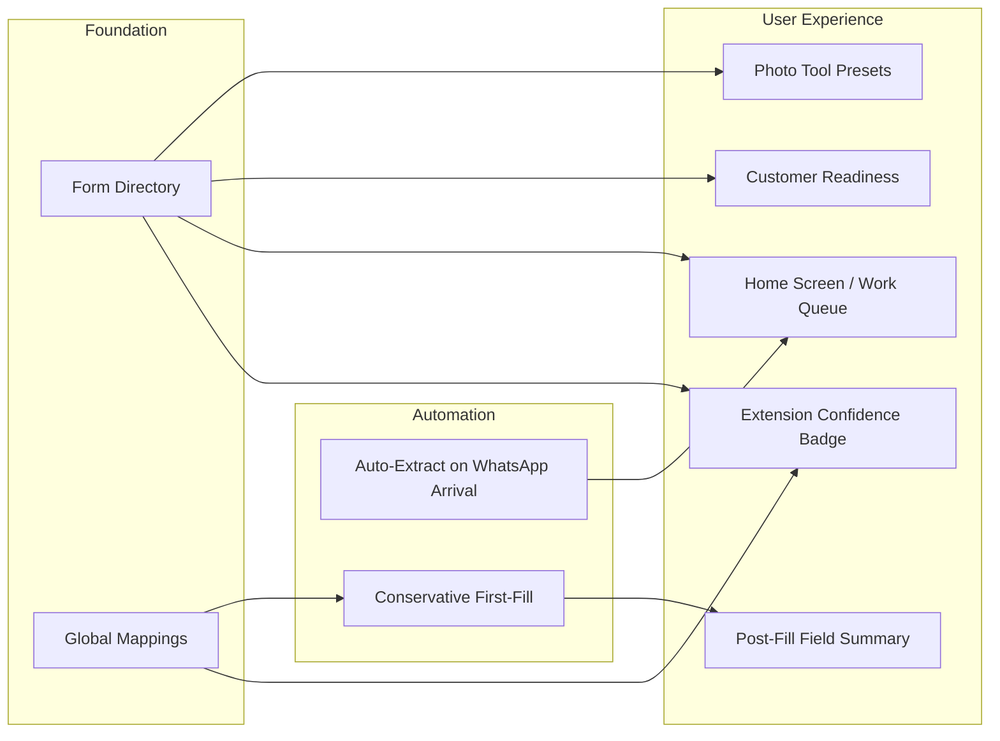

# CyberControl — Build Roadmap

## Now
```
┌─────────────────────────────────────────────┐
│ 1. Form Directory (DB + API + UI)           │
│    └── foundation for everything below      │
│                                             │
│ 2. Home Screen → Work Queue                 │
│    └── pending / ready / recent             │
│                                             │
│ 3. Extension Auth Fix                       │
│    └── end-to-end test on real Chrome       │
└─────────────────────────────────────────────┘
```

## This Week
```
┌─────────────────────────────────────────────┐
│ 4. Global Mappings (cross-workspace)        │
│                                             │
│ 5. Customer Readiness per Form              │
│    └── "SSC 85% ready, missing: roll no"    │
│                                             │
│ 6. Photo Tool Presets from Form Directory   │
│    └── one-click SSC/RRB/Passport specs     │
└─────────────────────────────────────────────┘
```

## Next Week
```
┌─────────────────────────────────────────────┐
│ 7. Auto-extract on WhatsApp arrival         │
│                                             │
│ 8. Conservative First-Fill Mode             │
│    └── only 100% confidence on new forms    │
│                                             │
│ 9. Post-Fill Field Summary                  │
│    └── "Name → Shubham ✓, Roll → empty"    │
└─────────────────────────────────────────────┘
```

## Dependency Graph


## Start: Form Directory (#1)
