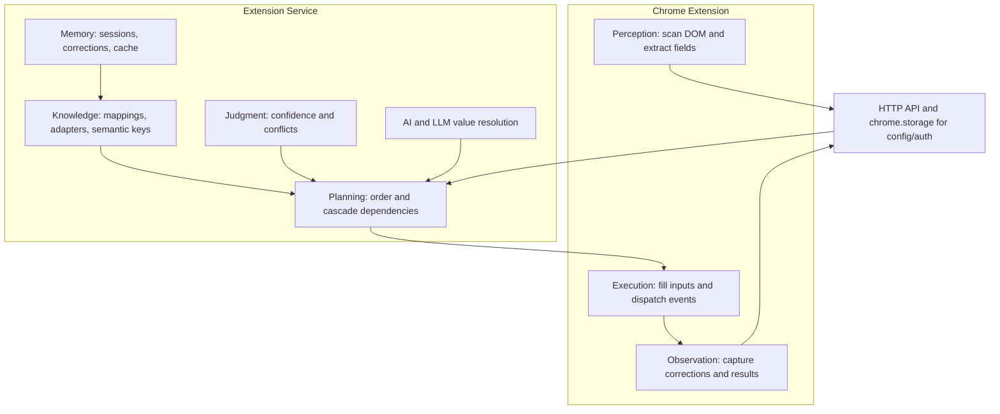
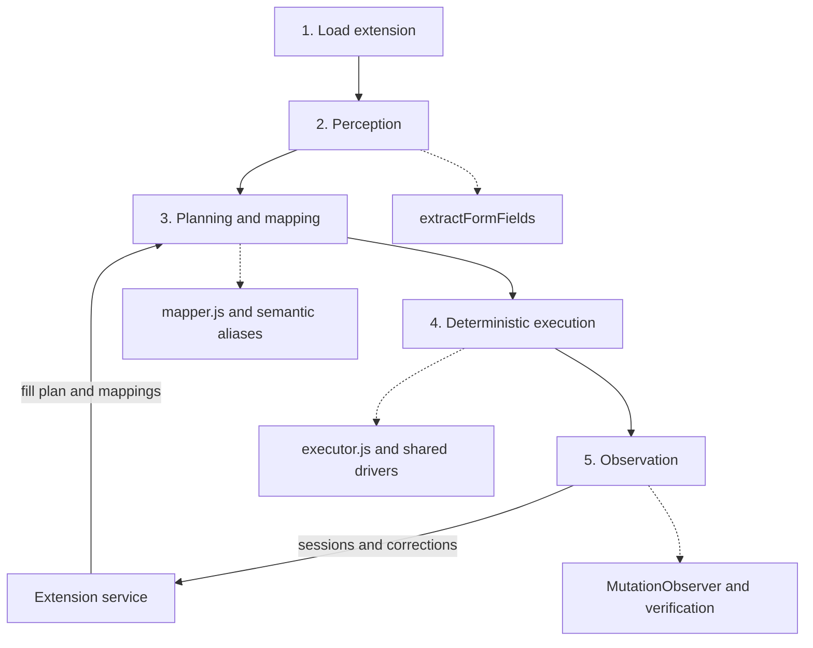

# Architecture Audit — CyberControl Extension

> **Issue**: #59 Phase 0.4  
> **Branch**: `issue-59/slim-architecture`  
> **Date**: 2026-08-03  
> **Phase 0 Status**: Foundation frozen (issues #55–#58 complete)

---

## 0. TARGET ARCHITECTURE: SLIM EXTENSION

The system is split into two layers with a clear boundary.



### Responsibility Assignment Matrix

│  shared/llm-client.js    → window.ccLLM                               │
│  shared/select-apply.js  → window.ccApplySelect                       │
│                                                                       │
│ executor.js :: executeFillPlan(plan)                                   │
│  Per field:                                                           │
│  ├─ TEXT → keystrokeFillSync() + verifyValue()                        │
│  ├─ NATIVE SELECT → ccMatchOption → ccApplySelect                     │
│  ├─ CUSTOM DROPDOWN → findPlugin() → ng-dropdown/cascade plugin       │
│  │   └─ fallback: AI select (ccLLM) if plugin fails                  │
│  ├─ DATE → fillDate() with format detection                           │
│  ├─ RADIO/CHECKBOX → ccMatchOption + click dispatch                   │
│  └─ CASCADE → fill parent + ccWaitForNetworkIdle + waitForOptions     │
└──────────────────────────────────────────────────────────────────────┘

┌──────────────────────────────────────────────────────────────────────┐
│ PHASE 5: OBSERVATION (Extension — correct layer)                      │
├──────────────────────────────────────────────────────────────────────┤
│ executor.js post-fill:                                                │
│  → injects MutationObserver on filled fields                          │
│  → captures operator corrections                                      │
│  → captures enrichments (fields operator fills manually)              │
│  → POSTs corrections to backend: /mappings/{formKey}                  │
│  → POSTs session results to backend: /sessions                        │
└──────────────────────────────────────────────────────────────────────┘
```

---

## 2. PHASE 0 CONSOLIDATION STATUS

All accidental duplicates resolved. Only intentional boundary-based copies remain.

### Shared Modules (5 files, all loaded at runtime)

| Module | Exposes | Callers |
|--------|---------|---------|
| `shared/option-match.js` | `window.ccMatchOption` | executor, cascade-select, ng-dropdown, drivers/select, rule-engine |
| `shared/dom-utils.js` | `window.ccDomUtils.{getLabel, isVisible, isGoodLabel}` | extractor, executor, ng-dropdown, drivers/dom, drivers/interaction |
| `shared/network-idle.js` | `window.ccWaitForNetworkIdle` | executor, drivers/interaction |
| `shared/llm-client.js` | `window.ccLLM.{call, parseJSON}` | mapper, ai-resolve, executor |
| `shared/select-apply.js` | `window.ccApplySelect` | cascade-select (executor has extended version) |

### Intentional Duplicates (service worker boundary)

These exist because `background.js` runs as a Chrome service worker and cannot access page-context `window.*` globals:

| Function | In background.js | Canonical Source |
|----------|-----------------|-----------------|
| `normalizeLabel` | line 6 | shared/label-utils.js:27 |
| `calcConfidence` | line 5 | shared/label-utils.js:48 |
| `normalizeFieldLabel` | line 908 | shared/label-utils.js:57 |
| `getSemanticKey` + `SEMANTIC_ALIASES` | lines 3–20 | shared/label-utils.js:10–34 |
| LLM fetch calls ×3 | lines 423, 533, 583 | shared/llm-client.js (can't be used in SW) |

### Remaining Violations Against Target Architecture

| Violation | File | Why It's Wrong | Migration Path |
|-----------|------|---------------|---------------|
| Mapping rules in extension | mapper.js | Intelligence belongs in service | Service returns pre-computed mapping |
| AI calls from page context | mapper.js, ai-resolve.js, executor.js | LLM is a planning concern | Service does AI, returns fill plan |
| Planning inline in popup | popup.js | Extension should just execute | Service returns ordered fill plan |
| Teach logic in background.js | background.js | Learning is a service concern | Service handles teach via API |
| Confidence scoring in extension | label-utils.js, background.js | Judgment belongs in service | Service computes and returns confidence |
| Rule engine in extension | rule-engine.js | Matching rules are knowledge | Service evaluates rules, returns mapping |

---

## 3. CURRENT FILE RESPONSIBILITIES

### Extension Layer (Perception + Execution + Observation) — CORRECT

| File | Role | Clean? |
|------|------|--------|
| `extractor.js` | Perception: scan DOM, resolve labels, extract fields | ✅ Delegates to shared |
| `executor.js` | Execution: fill fields, dispatch events, verify | ⚠️ Still has AI fallback |
| `shared/option-match.js` | Execution helper: fuzzy option matching | ✅ |
| `shared/dom-utils.js` | Perception helper: label + visibility | ✅ |
| `shared/network-idle.js` | Execution helper: wait for XHR quiet | ✅ |
| `shared/select-apply.js` | Execution helper: native select dispatch | ✅ |
| `plugins/interface.js` | Perception: component plugin registry | ✅ |
| `plugins/ng-dropdown.js` | Execution: Angular dropdown interaction | ✅ Delegates to shared |
| `plugins/cascade-select.js` | Execution: dependent dropdown cascade | ✅ Delegates to shared |
| `plugins/keystroke-input.js` | Execution: keystroke simulation | ✅ |
| `drivers/*` | Execution: low-level validated DOM ops | ✅ Cleanest module |

### Intelligence Layer (Currently in extension, SHOULD be in service)

| File | Role | Migration Priority |
|------|------|-------------------|
| `mapper.js` | Planning: field→value mapping + AI | HIGH — biggest intelligence leak |
| `ai-resolve.js` | Planning: AI value resolution | HIGH |
| `rule-engine.js` | Knowledge: scoring rules | MEDIUM |
| `shared/label-utils.js` | Knowledge: semantic aliases, confidence | MEDIUM |
| `shared/llm-client.js` | Infrastructure: LLM API wrapper | LOW (useful in both layers) |
| `derive.js` | Knowledge: computed profile values | MEDIUM |

### Orchestration (popup.js + background.js)

| File | Current Role | Target Role |
|------|-------------|-------------|
| `popup.js` | God object: auth + UI + orchestration + planning | Thin orchestrator: auth + UI + dispatch fill plan from service |
| `background.js` | Auth + teach + portal detection + confidence | Auth + portal detection only (teach → service) |

---

## 4. KNOWLEDGE STORAGE

### chrome.storage.local (config/auth only — correct for extension)

| Key | Purpose |
|-----|---------|
| `accessToken` / `refreshToken` | Auth tokens |
| `backendUrl` | API base URL |
| `user` | Current user object |
| `settings` | Extension preferences |

### Extension-Service (backend — owns all intelligence data)

| Endpoint | Purpose | Owner |
|----------|---------|-------|
| `/mappings/{formKey}` | Field→profileKey rules per form | Service (knowledge) |
| `/adapters/{hostname}` | Dropdown interaction recipes | Service (knowledge) |
| `/sessions` | Fill session records | Service (memory) |
| `/corrections` | Operator edits | Service (memory → learning) |
| `/profiles` | Profile CRUD | Service (knowledge) |
| `/settings/groq-key` | LLM config | Service (infrastructure) |

### In-Memory (page context, session-scoped — correct for extension)

| Variable | Purpose |
|----------|---------|
| `window.ccMatchOption` etc. | Shared utilities |
| `window._ccPlugins` | Plugin registry |
| `window.cc` | Driver registry |
| `document.body.dataset.ccAjaxActive` | Network monitor |

---

## 5. MIGRATION PLAN (Phase 1+)

### Phase 1: Service-Owned Fill Plans

The biggest architectural win. Instead of the extension running mapper.js + rule-engine.js + AI locally:

```
Current:  popup → extract → [mapper + AI + rules] → plan → execute
Target:   popup → extract → POST fields to service → receive plan → execute
```

**Steps:**
1. Service endpoint: `POST /fill-plan` accepts `{formFields, profileId, formKey}`
2. Service runs mapping + AI + rules + cached mappings server-side
3. Returns `{plan: [{selector, value, type, strategy}], confidence}`
4. Extension just executes the plan
5. mapper.js, ai-resolve.js, rule-engine.js become dead code in extension

### Phase 2: Service-Owned Teach

Move teach session logic from background.js to the service:

```
Current:  background.js → groqAutoTeach → store adapter locally
Target:   extension observes → POST observation to service → service learns
```

### Phase 3: Slim popup.js

Break popup.js god object into:
- `popup-ui.js` — DOM manipulation, event handlers
- `popup-auth.js` — login/logout/refresh
- `popup-orchestrator.js` — extract → call service → execute

---

## 6. PORTAL-SPECIFIC LOGIC

Hardcoded references that should become service-provided adapter configs:

| Pattern | Portals | Current Handling |
|---------|---------|-----------------|
| DWR cascade re-apply | ServicePlus | executor.js setTimeout 3.5s |
| jQuery `.trigger('change')` | ServicePlus, NIC | shared/select-apply.js |
| `.ng-select-container` | SSC, UIDAI | ng-dropdown.js plugin |
| `mat-select` | Banking portals | drivers/select.js |
| State→District→Block cascade | Indian govt forms | cascade-select.js |
| Masked input verification | UIDAI | executor.js verifyValue |

---

## 7. SUMMARY METRICS (Post Phase 0)

| Metric | Before (v5.91) | After (Phase 0 frozen) |
|--------|---------------|----------------------|
| Dead files | 4 (24KB) | 0 (deleted in #56) |
| Duplicate logic instances | 13 patterns, 30+ locations | 6 intentional (SW boundary) |
| Active bugs from duplication | 1 (calcConfidence) | 0 (fixed in #56) |
| Shared modules used at runtime | 0 | 5 |
| Tests | 0 | 59 (25 unit + 17 integration + 17 mapping) |
| Option matching copies | 5 | 1 canonical + delegators |
| isVisible copies | 5 | 1 canonical + delegators |
| LLM call patterns | 4 inline | 1 shared client + 3 SW boundary |

---

*Phase 0 foundation frozen. Extension is documented as execution-only target.  
Intelligence migration to extension-service is the Phase 1 objective.*
